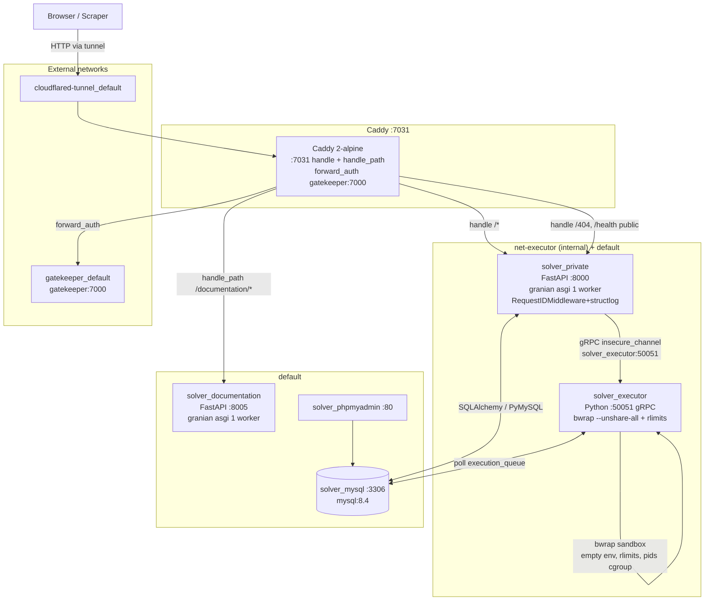

# Architecture

**Stack:** FastAPI + Granian 1 worker (solver_private `solver_private:8000`, `RequestIDMiddleware`+`structlog` JSON `{error:{code,message,request_id}}`), bwrap (executor `solver_executor:50051` gRPC), MySQL 8.4, Caddy 2 (`127.0.0.1:7031:7031`), FastAPI + Granian (documentation `solver_documentation:8005`)

## High-Level Container Diagram



## Network Topology

| Network | Driver | Members | Purpose |
|---|---|---|---|
| `default` | bridge | solver_private, solver_executor, solver_documentation, solver_mysql, solver_phpmyadmin, solver_caddy | App + docs + DB |
| `net-executor` | bridge `internal: true` | solver_private, solver_executor | gRPC `solver_executor:50051` only |
| `gatekeeper` | external `gatekeeper_default` | solver_caddy | `forward_auth gatekeeper:7000` |
| `cloudflared-tunnel` | external `cloudflared-tunnel_default` | solver_caddy | Public ingress via tunnel |

- `50051` is `expose` only — never `ports`-published. Caddy never proxies gRPC.
- `solver_private:8000` and `solver_documentation:8005` are `expose` only — Caddy is the sole published surface (`:7031` on the tunnel network).
- `phpmyadmin` is loopback-only `127.0.0.1:7032:80`.

## Data Flow

### 1. Problem ingestion (scraper → solver)

```
Codeforces HTML --scrape.py--> html/ --extract.py--> JSON
  --images_download.py--> images/ --images_upload.py--> DB image blobs
  --ai.py--> generator_code / solution_code / executor_code / hints
  --uploader.py POST /api/problems/upload--> solver_private --> MySQL problems
```

### 2. Code execution (browser → solver → executor → DB)

```
Browser POST /api/run/<cid>/<idx> (code, testcases)
  → solver_private: queue INSERT INTO execution_queue (queued)
  → (optional) gRPC EnqueueExecution → solver_executor:50051
  → executor poll loop fetch_queued() → mark_running
  → build_wrapper() + bwrap --unshare-all --ro-bind /usr ... python wrapper.py
  → parse_output() → result JSON → mark_completed + create_solution (if submit)
  → Browser poll GET /api/queue-status/<id> ← execution_queue row
```

gRPC and the DB queue are dual transports: the HTTP route always writes the queue row; when `EXECUTOR_GRPC_ADDR` is reachable the solver also notifies the executor via `EnqueueExecution` for sub-second wakeup (otherwise the executor's 1s poll picks it up within a second).

### 3. Documentation serving

```
Browser GET /documentation/ → Caddy handle_path strip → solver_documentation:8005
  → FastAPI app.py serves site/index.html (MkDocs Material build)
```

Gate: `forward_auth gatekeeper:7000 { uri /api/authz/forward-auth }` on `:7031` — same gate as the solver.

## Component Breakdown

| Component | Code | Port | Runtime |
|---|---|---|---|
| solver_private | `solver_private/` + `shared/` | 8000 | `python:3.14-slim`, `granian asgi 1 worker` (`wsgi:app`) + `RequestIDMiddleware`+`structlog` JSON `{error:{code,message,request_id}}` |
| executor | `executor/` + `shared/wrapper.py` | 50051 (gRPC) | `python:3.14-slim`, root + `SYS_ADMIN` + `bwrap` |
| documentation | `documentation/` + `shared/` | 8005 | `python:3.14-slim`, granian asgi, `USER appuser 10001` |
| mysql | `mysql:8.4` | 3306 | named volume `mysql_data` |
| phpmyadmin | `phpmyadmin:5.2` | 80 | loopback 7032 |
| caddy | `caddy:2-alpine` | 7031 | Caddyfile baked in |

## Shared Package

`shared/` is the cross-sector library (imported via `PYTHONPATH=/app/shared`):

- `db.py` — SQLAlchemy engine/session, `%s`→`:pN` shim for PyMySQL-compat queries
- `sqlalchemy_models.py` — `Problem`, `Solution`, `ExecutionQueue`, `AutoSave`, `ProblemImage`
- `models.py` — query helpers (`get_problem`, `get_solutions`, …)
- `wrapper.py` — `build_wrapper()` / `parse_output()` (used by executor and scraper AI validation)
- `startup.py` — `Base.metadata.create_all()` on boot
- `proto/` — `executor.proto` (gRPC contract)
- `proto_gen/` — generated `*_pb2.py` stubs
- `templates/base.html` + `static/` — base layout

## Security Notes

- Executor container runs as **root** with `SYS_ADMIN`, `seccomp:unconfined`, `apparmor:unconfined` — required for `bwrap --unshare-all` user ns. Mitigations: sandboxed code gets empty env, rlimits (`RLIMIT_AS`, `RLIMIT_CPU`, `RLIMIT_CORE`), pid cgroup (`pids_limit: 128`), and subreaper zombie reaping.
- GateKeeper is the only auth: Caddy `forward_auth` on every `handle` except `/health` and `/404`.
- MySQL creds are injected via compose `${MYSQL_PASS:?}` — no `.env` file, no hardcoding.
