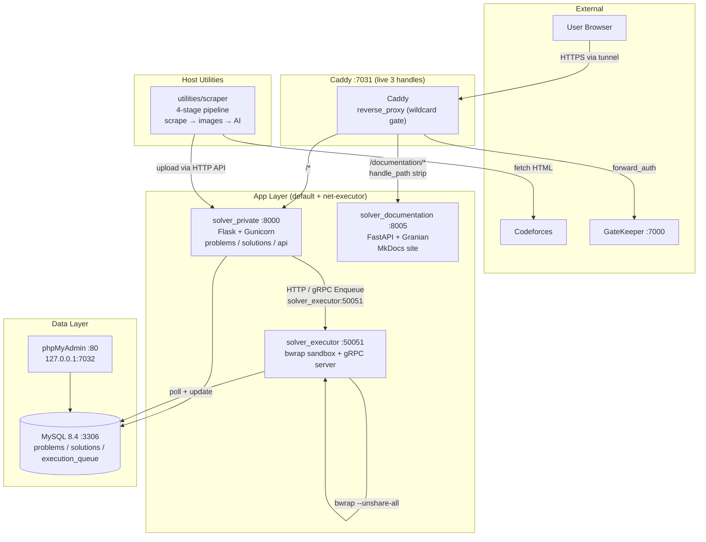

# SolveSpace

Codeforces problem-solving workspace. A scraper pipeline pulls Codeforces problems, AI-enriches them, and uploads them to a private Flask app where submitted code runs in a **bwrap** sandbox. An internal **gRPC** channel links the solver and executor for low-latency queue operations.

**Stack:** Python 3.14 · Flask 3.1 + Gunicorn (solver) · bwrap sandbox (executor) · MySQL 8.4 · Caddy 2 · MkDocs Material

**Docs:** This site (`documentation/`)

## Services Overview

| Service | Container | Internal Port | Caddy Route | Network |
|---|---|---|---|---|
| **Caddy** | `solver_caddy` | 7031 | — | default, gatekeeper, cloudflared-tunnel |
| **Solver Private** | `solver_private` | 8000 | `/*` (7031) | default, net-executor |
| **Executor** | `solver_executor` | 50051 (gRPC, internal) | — | default, net-executor |
| **Documentation** | `solver_documentation` | 8005 | `/documentation/*` (7031) | default |
| **MySQL 8.4** | `solver_mysql` | 3306 | — | default |
| **phpMyAdmin** | `solver_phpmyadmin` | 80 | — (127.0.0.1:7032) | default |

- Gate is at the **wildcard** (`gatekeeper_caddy:7000` → `gatekeeper_auth:8001` on `gatekeeper_dynamic`) — live `caddy/Caddyfile` proxies without a per-app `forward_auth` (wildcard per `reference/gatekeeper/caddy-setup.md`). Live ingress is 3 handles: `/health`, `/documentation/*`, catch-all.
- `solver_private ↔ solver_executor` talk over **gRPC** on `solver_executor:50051` (internal `net-executor`, `expose` only) plus the MySQL `execution_queue` table.
- Browser ingress is HTTP through Caddy (`:7031 → solver_private:8000`); internal RPC is gRPC.

## Architecture Diagram

## Quick Links

- [Getting Started](getting-started.md) — clone, env, `docker compose up`
- [Architecture](architecture.md) — diagram, networks, data flow
- [Solver Private](solver/index.md) — Flask blueprints, routes
- [Executor](executor/index.md) — bwrap sandbox, queue, gRPC
- [Scraper](scraper/index.md) — 4-stage pipeline
- [Shared](shared/index.md) — DB layer, models, wrapper
- [Docker](docker/index.md) — compose, Caddy, MySQL
- [API Contract](api-contract/index.md) — HTTP + gRPC
